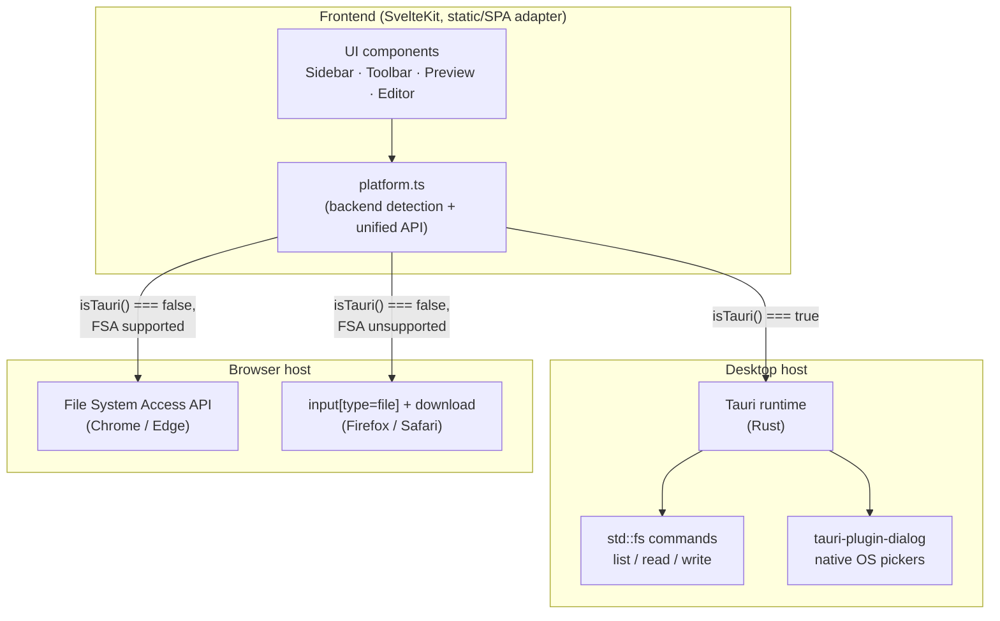
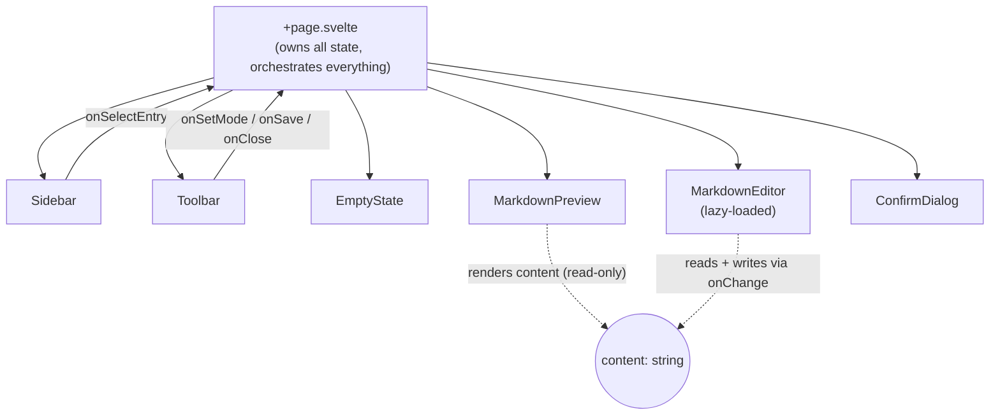
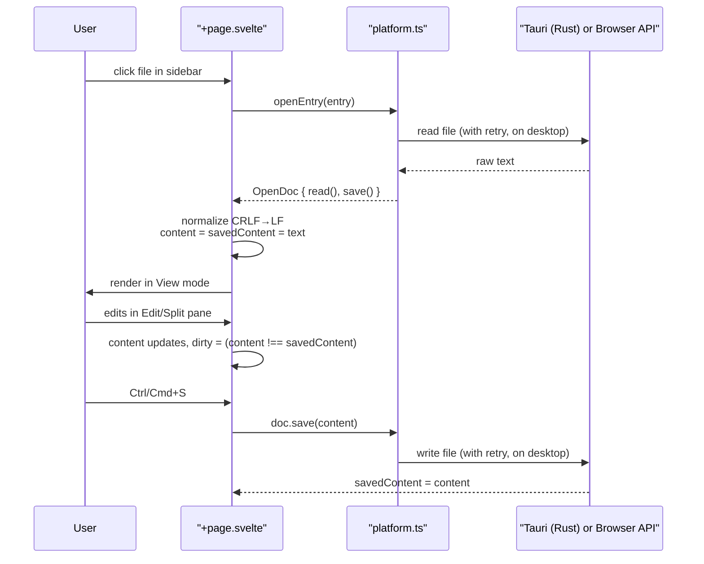
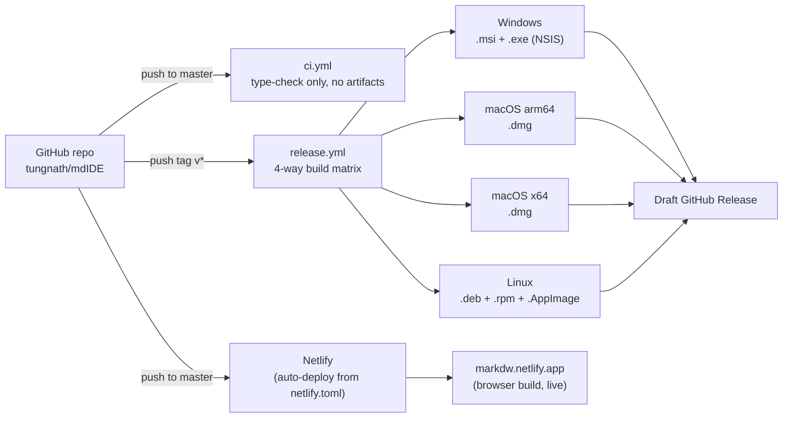

# Architecture

High-level shape of Marker: what runs where, how the pieces talk to each other,
and how it ships. For file-by-file detail and design rationale, see
[TECHNICAL_DESIGN.md](./TECHNICAL_DESIGN.md).

## System overview

Marker is a single Svelte/SvelteKit frontend that runs unmodified in two
different hosts. Which host it's running in is detected at runtime, and a
platform-abstraction layer swaps out how files actually get read/written.

The same `build/` output (one `npm run build`) is what both the Tauri window
loads locally and what gets deployed to Netlify. There is no server-rendered
or backend-hosted logic anywhere — every "backend" operation is either a
native OS call (desktop) or a browser API (web).

## Component architecture

`+page.svelte` is the single source of truth: one `content` string, one
`savedContent` snapshot to diff against for the dirty flag, and a `mode`
(`view` / `edit` / `split`) that decides which pane(s) render against that
same string. Nothing else holds independent state.

## Data flow: opening and saving a file

## Deployment architecture

Desktop builds are OS-native — Tauri links against each platform's own
WebView (WebView2 / WKWebView / WebKitGTK), so each leg of the release matrix
must run on that actual OS; there is no single-machine cross-compile path for
the full GUI bundle. See [TECHNICAL_DESIGN.md](./TECHNICAL_DESIGN.md) for the
manual, one-by-one equivalent of what the CI matrix automates.

## Technology stack

| Layer | Choice | Why |
|---|---|---|
| Desktop shell | [Tauri 2](https://tauri.app) (Rust) | Native WebView, ~10MB installers vs. Electron's ~100MB+; first-party plugin ecosystem (`dialog`, `fs`) and release tooling (`tauri-action`) |
| Frontend framework | SvelteKit (static/SPA adapter, no server) | Small runtime, compiles away rather than shipping a VDOM; SPA mode needed since there's no Node server on desktop |
| Editor | [CodeMirror 6](https://codemirror.net) | Purpose-built for text editing, far lighter than Monaco; lazy-loaded so it doesn't cost anything until Edit/Split is opened |
| Markdown rendering | `marked` + `marked-highlight` + `highlight.js` + `DOMPurify` | GFM support, syntax-highlighted fences, and mandatory sanitization since rendered content is untrusted file input |
| Backend logic | Rust `std::fs`, exposed as `#[tauri::command]`s | The only "backend" work is list/read/write files — no case for a second runtime (e.g. Python) to do that |

Alternatives considered and set aside: Electron (too heavy for the stated
"very lightweight" requirement), Neutralino.js (lighter binaries, but a
thinner native API surface and no first-party CI release action), Streamlit
(server-rerun model is fundamentally unsuited to keystroke-level editing),
and a Python backend (would mean bundling a second runtime for logic Rust's
standard library already covers in a few lines).
